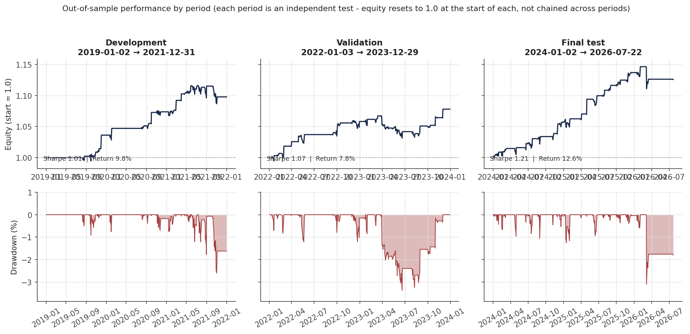
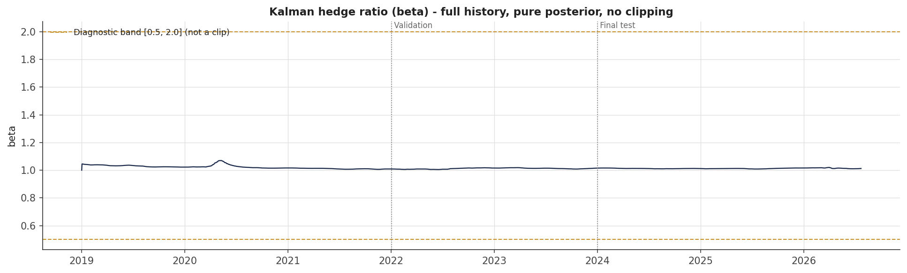
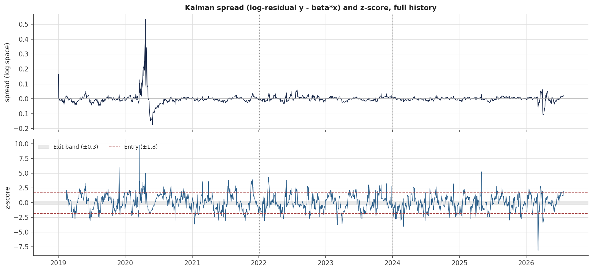

# Brent–WTI Statistical Arbitrage: Kalman-Filtered Pairs Trading Backtest

A research backtest of a Brent/WTI crude oil statistical arbitrage strategy: a volatility-adaptive Kalman-filtered dynamic hedge ratio, a cointegration-inspired mean-reversion signal, a volatility regime filter, and volatility-targeted position sizing. Includes a lightweight "should we trade today" market checker, a standalone Monte Carlo price forecast, and a frozen-parameter out-of-sample evaluation.

**What this is not:** there is no order execution, broker connection, or live capital involved anywhere in this repo. Everything here is a historical backtest and a set of diagnostic tools — treat the results as a research exercise, not a performance guarantee. `market_check.py`'s contract-count suggestion is a research signal check, not a trade-ready instruction: it does not verify contract specifications, exact multipliers, currency, margin requirements, or data staleness before suggesting a size — see "Known limitations". It also does not model futures contract roll mechanics (see "Known limitations" below) — `CL=F`/`BZ=F` are continuous front-month series, not a single tradable instrument.

## At a glance

* Brent–WTI statistical arbitrage backtest: a volatility-adaptive Kalman-filtered dynamic hedge ratio, a regime-gated mean-reversion signal, and volatility-targeted position sizing.
* Frozen-parameter, walk-forward out-of-sample evaluation across three periods (2019–2026): Sharpe of `1.01`, `1.07`, and `1.21` net of transaction costs for development, validation, and final-test respectively (see "Results" for the full table).
* No order execution, broker connection, or live capital anywhere in this repo — see "What this is not" directly below for what that does and doesn't mean.
* "Results" and "OOS evaluation: a bug found and fixed" are the two sections with the most substance, if you're reading selectively.

## Contents

| File                       | What it does                                                                                                                                                                                                                                                                   |
| -------------------------- | ------------------------------------------------------------------------------------------------------------------------------------------------------------------------------------------------------------------------------------------------------------------------------ |
| `main.py`                  | Full-history backtest: data loading, Kalman hedge ratio, ADF stationarity test, OU half-life, z-score signal, regime filter, risk scaling, PnL, walk-forward check, parameter sensitivity sweep, cost stress test, roll-drag sensitivity, equity curve                         |
| `market_check.py`          | "Should we trade right now?" — recomputes the same beta/spread/risk-scale on recent data (via `spread_model.py`) and, if there's a signal, translates it into concrete WTI/Brent futures contract counts sized by the same vol-targeting logic as the backtest. A research signal check, not a trade-ready instruction — see "What this is not" |
| `monte_carlo_engine.py`    | Standalone 10-day GBM Monte Carlo forecast for WTI, independent of the stat-arb signal                                                                                                                                                                                         |
| `config.py`                | Single, frozen source of truth for every tunable constant (`StrategyConfig`) and the three OOS period boundaries                                                                                                                                                               |
| `spread_model.py`          | Shared model logic: Kalman hedge ratio, z-score, regime filter, risk scaling, position logic, and performance metrics — imported identically by every script below, so none of them can silently disagree about what "the spread" is                                           |
| `validation.py`            | OU/AR(1) mean-reversion half-life estimate (diagnostic / parameter-justification only — see Methodology); parameter sensitivity sweep (development period only — see below)                                                                                                    |
| `costs.py`                 | Transaction-cost stress test (low / base / stress bps scenarios, base fixed to match `config.cost_per_turnover`)                                                                                                                                                               |
| `roll_costs.py`            | Stylized futures roll-cost drag sensitivity check — applies a configurable annualized bps drag while a position is held and reports Sharpe with/without it. Not a real per-contract roll simulation (`CL=F`/`BZ=F` have no curve data behind them); see "Known limitations"    |
| `oos_evaluation.py`        | Frozen-parameter evaluation across development / validation / final-test periods. See "OOS evaluation: a bug found and fixed" below before trusting any earlier version of this file's output                                                                                  |
| `parameter_sensitivity.py` | Standalone entry/exit sensitivity sweep on real downloaded data, development period only                                                                                                                                                                                       |
| `generate_report_charts.py` | Reads the committed `results/*.csv` and writes the PNG charts embedded below to `results/charts/` — no network access, just plotting. Rerun after `oos_evaluation.py` to keep the images in sync with the numbers                                                             |

## Methodology

* **Dynamic hedge ratio — a volatility-adaptive Kalman filter.** Rather than fitting a single beta once on the whole history, `Brent ≈ beta × WTI` is re-estimated day by day in log-price space, so the hedge ratio can drift slowly as the true relationship between the two benchmarks changes. This is a pure posterior estimate: no clipping, no post-hoc smoothing. Both the process noise (Q) and observation noise (R) are scaled up on volatile days — this is a heuristic adaptive-noise variant, not a textbook constant-Q/R Kalman filter, which is why it's named that way here rather than just "Kalman filter." Raising Q and R together does not, by construction, guarantee beta becomes more responsive on volatile days — the net effect runs through the Kalman gain (`P_pred·x² / (P_pred·x² + R)`), which depends on both terms jointly, not on either one in isolation. Treat "beta adapts faster in volatile regimes" as an observed tendency in this parameter range (see the printed Kalman diagnostics each run), not a property the Q/R formula guarantees on its own. The old `[0.5, 2.0]` plausibility range is now a diagnostic-only band: `spread_model.compute_beta_and_spread` logs and counts how often beta leaves it, without ever altering beta.
* **Stationarity check (ADF test)**, run directly on the traded spread — not a proxy — both over the full history (`main.py`) and on a rolling recent window (`market_check.py`), since a spread that was stationary in 2019 may not be stationary today. This tests stationarity of the dynamically reconstructed (time-varying-beta) spread actually traded, which is a different and looser claim than a classical Engle–Granger cointegration test with a single fixed hedge coefficient over the full sample — the two are not interchangeable evidence.
* **OU / AR(1) half-life estimate**, fit on the traded spread, gives a data-derived mean-reversion speed. The z-score window is chosen with this as a reference point (roughly 1.5–2× the estimated half-life) rather than being an arbitrary round number. This is a diagnostic / parameter-justification check computed on the same data the strategy trades — not an independent out-of-sample validation that mean reversion exists.
* **Z-score entry/exit signal with hysteresis:** a rolling z-score of the spread against its own trailing local mean (not a fixed fundamental value), entering at `|z| > entry_threshold` and exiting at `|z| < exit_threshold`, so the position doesn't flip open/closed every time z drifts near a single threshold.
* **Regime filter:** trading is switched off whenever recent spread volatility sits in the top 30% of its trailing 100-day range — a volatility-gating rule, not a full regime-detection model.
* **Volatility targeting:** position size is scaled so the hedged pair (Brent leg + beta × WTI leg together, via an EWMA covariance estimate) targets a constant annualized volatility — not each leg individually.
* **Transaction costs** are charged on every change in position size.

Every signal input — z-score, regime label, risk scale, and the position itself — is computed with `.shift(1)`, and the PnL step explicitly uses yesterday's position and beta (`pos_lag`, `beta_lag`) against today's return. This is what keeps the backtest from leaking future information into itself. (`risk_scale` is shifted inside `compute_risk_scale`, while `compute_performance` uses `position.shift(1)` and `df["beta"].shift(1)`.)

## Validation & robustness checks

* ADF stationarity test on the traded spread.
* OU half-life estimate, cross-checking the configured z-score window (diagnostic, computed on the same data the strategy trades — see Methodology).
* Frozen-parameter OOS evaluation across development (2019–2021), validation (2022–2023) and final-test (2024–`FROZEN_DATE` — see the note on this label under "OOS evaluation: a bug found and fixed") — see `oos_evaluation.py` and the dedicated section below.
* Parameter sensitivity sweep over entry/exit thresholds, run only on the development slice. This checks robustness to that specific pair of parameters — it does not sweep the Kalman noise terms, regime thresholds, or risk target, so "robust to parameter choice" should be read as scoped to entry/exit, not the model as a whole.
* Transaction cost stress test at low/base/stress bps scenarios, reusing the exact position path from the primary run.
* Futures roll-drag sensitivity check (stylized annualized bps assumption — see `roll_costs.py`).
* Kalman diagnostics: how often, and by how much, beta left the `[0.5, 2.0]` historically-plausible band on real data.

None of these prove the strategy works. They narrow down how it could be fooling itself, which is a more answerable question.

One thing code alone cannot certify: `config.FROZEN_DATE` records when these parameters were locked, but that timestamp is a discipline aid, not proof of ex-ante blindness — it doesn't by itself establish that the final-test period's results were genuinely unseen before the freeze. That's a claim about research process, not something a config file can enforce or verify on its own.

## OOS evaluation: a bug found and fixed

The first version of `oos_evaluation.py` sliced the raw price data into three independent chunks (development / validation / final-test) before computing the model, and ran the Kalman filter, z-score, regime filter, and risk scaling fresh on each chunk. This silently reset beta to its initial guess (`1.0`) and wiped every rolling window at the start of both the validation and final-test periods — verified directly on the exported `oos_daily_returns.csv`: beta reset to exactly `1.0000` on the first day of each of those periods, and the regime filter showed "too volatile to trade" on 100% of the first 120 days of both periods — not because the market was actually turbulent, but because the 100-day regime lookback simply had no history yet.

Measured impact, same real data, before vs. after fixing this:

| Period                | Reset-per-period (bug) | Continuous, sliced only for reporting (fixed) |
| --------------------- | ---------------------- | --------------------------------------------- |
| Development 2019–2021 | 1.009                  | 1.009                                         |
| Validation 2022–2023  | 0.659                  | 1.070                                         |
| Final test 2024–2026  | 1.045                  | 1.212                                         |

Two causal implementations were written and cross-checked against each other on the same data:

1. Compute the model once over the full history and slice only for reporting.
2. Compute each evaluation period over an expanding history ending at that period's end date, then slice performance to the target period.

This is what `oos_evaluation.py` currently does. They agree to three decimal places because every function in `spread_model.py` is strictly causal (`.shift(1)`, recursive, or backward-looking rolling windows only). A model like this needs continuous history to be in the state a real, continuously-run strategy would actually be in on any given date; only performance reporting should be period-scoped, never the model computation itself.

Approach (2) does recompute some history redundantly — development gets recomputed inside validation's expanding window, and again inside final-test's — harmless, but see "Known limitations".

Why this is documented here instead of quietly corrected: the reset version wasn't a different, equally-valid test condition — it measured a different and unrealistic strategy that forgets three years of tracked history on an arbitrary calendar boundary, and it understated validation Sharpe by approximately `0.41` as a direct result. Calling that "different test conditions" would be shading the truth; calling it a bug that was caught, quantified, and fixed is both more accurate and a stronger thing to be able to say out loud.

A note on the "final test" label, and why this README used to carry more than one number for it: **2024–2026 was originally a configured target window with an open "today" end boundary, not a claim that the period had already finished** — Yahoo Finance can only return data through the latest available trading day, so every rerun before the fix described below would pull in a few more days and shift the final-test figure slightly.

That's why development (`1.009`) and validation (`1.070`) always agreed exactly between any two tables in this README — closed historical windows can't change between runs — while final-test did not: the bug-impact table above (`1.212`), an earlier version of the "Results" table (`1.181`), and the committed `results/oos_daily_returns.csv`/`oos_results.csv` at one point (`1.325`) were three numbers from three different run dates. None of them was wrong; they described three different amounts of accumulated data. Treating any single one as "the" final-test number without a date attached would have been misleading no matter which was picked, and it's exactly the kind of inconsistency a careful reader would (rightly) flag — because that's what happened here.

That's now fixed at the source instead of managed with more caveats: `config.OOS_PERIODS`'s final-test end date is pinned to `FROZEN_DATE` instead of the still-future `2026-12-31` (which is what made every run's effective end boundary "today"). Now that "Results" below has been regenerated after this change, that figure should stay put on unrelated reruns — it will only change when `FROZEN_DATE` itself is deliberately moved forward, which is a conscious, dated decision rather than a side effect of rerunning something unrelated. The `1.212` above stays as a record of the bug's measured size on one specific historical run, not a number to cite going forward.

## Setup

```bash
pip install -r requirements.txt
```

## Usage

```bash
python main.py                  # full backtest: metrics, validation checks, equity curve
python market_check.py          # is there a signal right now? + suggested contract sizes
python monte_carlo_engine.py    # 10-day WTI price forecast
python oos_evaluation.py        # frozen-parameter OOS evaluation -> results/oos_*.csv
python parameter_sensitivity.py # entry/exit sensitivity on real data (development period)
python generate_report_charts.py # results/*.csv -> results/charts/*.png (no network needed)
```

`config.py`, `spread_model.py`, `validation.py`, `costs.py`, and `roll_costs.py` are not meant to be run directly — they're imported by the scripts above.

## Hardcoded parameters — what they are and why

None of these were fit by optimizing the backtest's own Sharpe ratio — they're priors and safety bounds, chosen for the reasons below and then checked, not tuned.

### Kalman filter — hedge ratio dynamics

| Parameter                         | Value             | Why                                                                                                                                                                                                                                                                                                            |
| --------------------------------- | ----------------- | -------------------------------------------------------------------------------------------------------------------------------------------------------------------------------------------------------------------------------------------------------------------------------------------------------------- |
| `kalman_q` (process noise)        | `1e-6`            | How fast the filter is allowed to believe beta is drifting — a very small value encodes a slowly moving true relationship.                                                                                                                                                                                     |
| `kalman_r` (observation noise)    | `0.01`            | How much a single day's price pair is trusted.                                                                                                                                                                                                                                                                 |
| Vol-scaling multipliers           | ×10 on Q, ×5 on R | Both noise terms rise together on volatile days. Empirically this tends to let beta move faster in volatile periods in this parameter range, but the exact effect runs through the Kalman gain — which depends on Q and R jointly, not either alone — rather than being guaranteed just by raising both terms. |
| `beta_warn_min` / `beta_warn_max` | `[0.5, 2.0]`      | Diagnostic only — not applied to beta. Logged and counted via `KalmanDiagnostics` when left.                                                                                                                                                                                                                   |
| Initial beta, P                   | `1.0`, `1.0`      | Neutral 1:1 prior before seeing any data.                                                                                                                                                                                                                                                                      |

### Signal generation

| Parameter       | Value   | Why                                                                                                                              |
| --------------- | ------- | -------------------------------------------------------------------------------------------------------------------------------- |
| Z-score window  | 30 days | Cross-checked against `validation.estimate_ou_half_life` each run — a common rule of thumb is 1.5–2× the estimated OU half-life. |
| Entry threshold | 1.8     | An uncommon deviation for a roughly normal variable. Sensitivity checked directly.                                               |
| Exit threshold  | 0.3     | Close to zero, so a position closes as the spread meaningfully reverts.                                                          |

### Regime filter

| Parameter                | Value    | Why                                                     |
| ------------------------ | -------- | ------------------------------------------------------- |
| Spread-volatility window | 20 days  | Proxy for current spread turbulence.                    |
| Percentile lookback      | 100 days | Recent history the 20-day volatility is ranked against. |
| Percentile threshold     | 0.7      | Trade only in the calmer 70% of recent regimes.         |

### Risk scaling

| Parameter                    | Value          | Why                                            |
| ---------------------------- | -------------- | ---------------------------------------------- |
| Target annualized volatility | 10%            | Conservative, round-number risk budget.        |
| Leverage clip                | `[0.1×, 2.0×]` | Safety fuse on the vol-targeting formula.      |
| EWMA span                    | 30             | Same order of magnitude as the z-score window. |

### Transaction costs

| Parameter                                    | Value                                    | Why                                                                                                                                                                                                                                                                                            |
| -------------------------------------------- | ---------------------------------------- | ---------------------------------------------------------------------------------------------------------------------------------------------------------------------------------------------------------------------------------------------------------------------------------------------- |
| Cost per unit of turnover (primary/reported) | `0.0005` (5 bps)                         | Flat stand-in for real bid-ask + commissions — an assumption, not derived from real quotes.                                                                                                                                                                                                    |
| Stress-test scenarios                        | `2.5 / 5.0 / 10.0 bps` (low/base/stress) | "Base" intentionally matches the primary 5 bps assumption above, so that row reproduces the primary run's Sharpe as a sanity check. "Stress" is 2× base — a genuine stress case, fixing an earlier version where the labeled stress scenario was actually cheaper than the primary assumption. |

### Roll-drag assumption

| Parameter              | Value     | Why                                                                                                                                                                                                      |
| ---------------------- | --------- | -------------------------------------------------------------------------------------------------------------------------------------------------------------------------------------------------------- |
| `roll_drag_annual_bps` | 25 bps/yr | A stylized order-of-magnitude drag applied while a position is held, standing in for futures roll cost this project has no curve data to compute directly — see `roll_costs.py` and "Known limitations". |

## Results

Frozen config version `frozen_step_1_v1`, frozen `2026-07-22`. From `oos_evaluation.py`'s corrected causal expanding-history computation:

| Period                                  | Return  | Sharpe | Sortino | Max DD | Trades |
| ---------------------------------------- | ------- | ------ | ------- | ------ | ------ |
| Development 2019–2021                    | 9.77%   | 1.009  | 1.198   | -2.61% | 206    |
| Validation 2022–2023                     | 7.79%   | 1.070  | 1.385   | -3.37% | 187    |
| Final test 2024–2026 (frozen `2026-07-22`) | 12.56%  | 1.207  | 0.901   | -3.10% | 194    |

Final-test's window is now frozen to `config.FROZEN_DATE` rather than "today" (see "OOS evaluation" above for why) — this row was regenerated once after that change and should now stay put on unrelated reruns, moving only if `FROZEN_DATE` itself is deliberately edited forward.

Visual diagnostics, generated directly from the CSVs above via `generate_report_charts.py` (not live-rendered for this README, so refresh them the same way after any future data update):



Beta stayed inside the `[0.5, 2.0]` diagnostic band on 100% of days in every period (no warnings raised):





Worth flagging rather than glossing over: final-test Sortino (`0.901`) is lower than its own Sharpe (`1.207`), unlike development and validation, where Sortino exceeds Sharpe as usual. That means downside deviation is proportionally larger relative to mean return in final-test than in the other two periods — this period's losing days are relatively more severe/asymmetric, even though headline risk-adjusted return is still the best of the three. Not a red flag on its own, but a reason to look at the drawdown shape in final-test specifically before citing this number without qualification.

**Parameter sensitivity (development period, real data):** configured `(1.8, 0.3)` Sharpe = `1.009`; the tested grid ranged from `0.702` to `1.472`, and all tested combinations produced positive Sharpe. The best grid point (`entry=2.0`, `exit=0.4`, Sharpe=`1.47`) is not the configured pair. This shows that the configured thresholds are not simply the in-sample maximum of this tested entry/exit grid. It does **not**, by itself, prove that the thresholds were chosen without prior exposure to the development results, or that other model parameters were not selected using the data.

Still to fill in: block bootstrap CI on Sharpe (planned).

## Resolved in this version

* Duplicated Kalman filter core (`main.py` / `market_check.py`) → extracted into `spread_model.py`.
* Kalman filter was a heuristic hybrid (clip + post-hoc smoothing, inconsistent with its own uncertainty term `P`) → removed; pure Kalman posterior, diagnostic-only warning band.
* Z-score window was an unjustified round number → cross-checked against a data-derived OU half-life estimate.
* No parameter sensitivity check → added, scoped to the development period.
* Single flat transaction cost, never stress-tested → three-scenario stress test added.
* `main.py`'s `pct_change()` recomputed every Kalman iteration (`O(n²)`) → fixed.
* OOS evaluation reset the model at every period boundary → fixed; see dedicated section above.
* `.gitignore` was UTF-16-encoded and silently did nothing (git doesn't parse that encoding) → re-saved as UTF-8, verified with a real `git init`; added `*.iml`.
* `oos_evaluation.py` / `parameter_sensitivity.py` had inconsistent, heavily fragmented formatting unlike the rest of the codebase → reformatted to match the rest of the codebase; `parameter_sensitivity.py` now imports `load_data` from `oos_evaluation.py` instead of keeping a second copy.
* `costs.py`'s "stress" scenario (`2 bps`) was actually lower than the `5 bps` primary cost assumption → scenarios redefined so `base` matches `config.cost_per_turnover` exactly and `stress` is 2× that.
* "Spread" meant two different things across files (Kalman log-residual vs. plain dollar difference) → `monte_carlo_engine.py`'s field renamed to `brent_wti_diff_usd` to make the distinction explicit instead of documented-but-ambiguous.
* Added `roll_costs.py`: futures roll-drag sensitivity check, previously the single largest unmodeled gap with no mitigation at all.
* Terminology precision pass: Kalman filter explicitly labeled volatility-adaptive rather than implying textbook constant-Q/R behavior; ADF-on-dynamic-spread distinguished from classical fixed-coefficient cointegration testing; OU half-life labeled diagnostic/parameter-justification rather than independent validation; "final test 2024–2026" clarified as a target window, not a completed period, before `2026-12-31`; added a caveat that `FROZEN_DATE` is a discipline aid, not proof of ex-ante blindness; `market_check.py` explicitly flagged as a research signal check, not a trade-ready instruction.
* `requirements.txt` was UTF-16-encoded, same class of bug as the `.gitignore` fix above but missed at the time → re-saved as UTF-8.
* `ArbitrageBot.iml` stayed tracked by git after `*.iml` was added to `.gitignore` — adding a pattern doesn't retroactively untrack an already-committed file → removed from tracking.
* `main.py`'s non-positive-price guard ran on the full pre-flatten yfinance download (Open/High/Low/Close/Volume × 2 tickers), so `Volume == 0` on an ordinary day — unrelated to price validity — could trigger a "negative price detected" warning that had nothing to do with the actual WTI event the comment describes → reordered to flatten-to-Close first, then check, matching `oos_evaluation.py`; also pinned `auto_adjust=False` there and in `market_check.py` to match `oos_evaluation.py` instead of relying on yfinance's version-dependent default.
* Kalman volatility-scaling term unconditionally zeroed out on the very first recursion step (`t == 1`) even though that step's return is already a valid, non-NaN value → redundant `t > 1` guard removed.
* `mr_regime` exported as a mixed-type column (`0` on row one, `True`/`False` everywhere else, from `fillna(0)` on a boolean series) → `fillna(False)` + explicit `astype(bool)`.
* `market_check.py`'s position sizing was described as approximating `risk_scale` but never actually referenced realized volatility (`capital_usd * target_annual_vol`, full stop) → `check_market_health` now calls `spread_model.compute_risk_scale` directly and `describe_trade_action` sizes against the real current value, exactly like the backtest does.
* `monte_carlo_engine.py` fetched WTI and Brent from two independently-windowed histories with no check that their last available dates matched → unified into one aligned download; also replaced global `np.random.seed` with a local `Generator`, and softened an overstated docstring claim that a fixed seed "would defeat the purpose" of a Monte Carlo run.
* `.gitignore` carried a UTF-8 BOM (git handled it correctly, but not every tool is that forgiving) → re-saved without one.
* `x == x` NaN-check idiom in `validation.py` / `costs.py` (correct, but reads like a typo) → replaced with `pd.isna(...)`.
* The final-test OOS window's end date tracked "today" on every rerun, so this README carried three different final-test Sharpe numbers at different times depending on when each artifact was last regenerated (`1.212` in the bug-impact table, `1.181` in an earlier "Results" table, `1.325` in the committed CSV) → `config.OOS_PERIODS` now freezes the end date to `FROZEN_DATE`; see the dedicated note in "OOS evaluation" above.
* No visual evidence in the README itself, only a `plt.show()` in `main.py` that needs a live session and leaves no artifact → added `generate_report_charts.py` (reads the committed `results/*.csv`, writes the charts embedded in "Results" above) and `main.py` now also saves its equity curve to `results/charts/`.

## Known limitations (still open)

* **Futures contract roll mechanics are still not truly modeled.** `roll_costs.py` adds a stylized annualized drag as a sensitivity check, but that is an assumed order-of-magnitude figure, not a real per-contract roll simulation — `CL=F`/`BZ=F` are continuous front-month series with no futures-curve data behind them in this project. Probably still the single largest gap between what's reported here and what live trading would realize.
* **`market_check.py` is a research signal check, not a decision-grade tool.** It does not verify exact contract multipliers/tick sizes, currency, margin requirements, data staleness, or roll status before suggesting a position size. Turning it into something safe to act on would need those checks added first.
* **No re-fit-per-window OOS test yet.** Parameters are fixed once across the whole history, not re-estimated on rolling/expanding windows.
* **`main.py` is still a flat orchestration script.** The model logic it used to duplicate now lives in importable modules; what's left inline is sequencing and printing/plotting.
* **Cost stress test and roll-drag check are both stylized**, not realistic execution/market-impact or futures-curve simulations. They would need real order-book and futures-curve data, which this project does not have.
* **`oos_evaluation.py` recomputes some periods' history redundantly** — development is recomputed inside validation's expanding window, and again inside final-test's — harmless (verified numerically identical to a compute-once version) but not the most efficient structure; a candidate for simplification, not a correctness issue.
* **Ex-ante blindness for the final-test period is a research-process claim, not something this repo's code can prove on its own** — see the `FROZEN_DATE` note under "Validation & robustness checks."

## Reproducing this project's history

Git commit history is the source of truth for how this evolved, including the bug above — there's no `archive/` folder of superseded scripts in this repo, and there shouldn't be: keeping old, known-incorrect versions sitting in the working tree invites someone running the wrong file by accident. Old, non-current results are likewise not committed as parallel CSVs; only the current `results/oos_results.csv` / `results/oos_daily_returns.csv` are checked in, and the before/after numbers that matter for the record are the table above, not a second copy of the incorrect data. Commit messages for methodology-affecting changes state the numeric impact, e.g.:

```text
Fix: OOS evaluation reset Kalman/z-score/regime state at each period boundary, understating validation Sharpe by ~0.41 (see README).
```